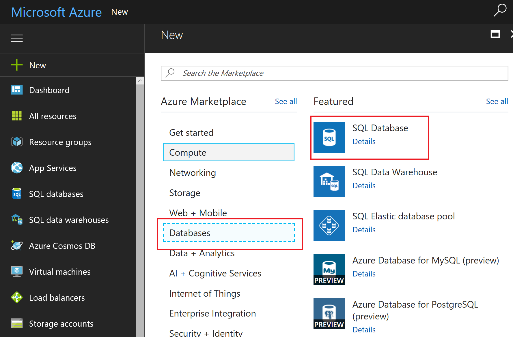

# HOL - Get started with web app development in Azure

In this lab we have an application called PartsUnlimited. We want to setup in Azure
an environment where we can deploy this application. In addition to that, we want
to monitor, update, scale, debug, etc...

## Pre-requisites

- Access to a MSDN Azure Subscription
- A Microsoft Account which can be created [here](https://signup.live.com) if you don't already have one

## Setup your environment

To complete this lab you will need to either configure your environment or deploy an already configured VM in Azure.

### Option 1: Deploy from Azure

Here is the step by step guide to deploy this virtual machine.

- Open the [Azure Portal](https://portal.azure.com)
- Press the New button on the top left to deploy a new Azure Resource

  
- Search for "Visual Studio Community 2017" and then press enter to filter.

  
- Select Visual Studio Community 2017 (latest release) on Windows 10 Enterprise N (x64)
- Follow the creation wizard. Since the machine will be up for only a few hours, I suggest provisioning a beefy one to get the best performances.

### Option 2: Configure your own environment

Here are the tools that should be installed:

- Visual Studio Community 2017 which can be downloaded [here](https://www.visualstudio.com/thank-you-downloading-visual-studio/?sku=Community&rel=15)
- Run the installer and make sure to select ".NET Desktop Development", "ASP.NET and web development tools" and "Azure development". This will ensure that you have all the required components including SQL Serer Express installed.

  

## Tasks Overview

### Clone the repository

 In this step, you will clone the source code repository from Github using Visual Studio. You will also checkout the aspnet45 branch where the relevant code is located.

- Open Visual Studio 2017 and open the Team Explorer.
- Select the manage connection button

  
- Enter https://github.com/dchapdelaine/PartsUnlimited.git as the URL of the repo. Press clone to initiate the cloning.
- Once the cloning has completed, change the current branch to aspnet45. To do so, select the "master" branch at the lower right of the screen and then select the manage branches menu.

  
- Expand the "remotes/origin" node and then double-click on "aspnet45"

> Note: This could also be done with git on the commandline. You would run:
> ```bat
> git clone https://github.com/dchapdelaine/PartsUnlimited.git
> cd PartsUnlimited
> git checkout aspnet45
> ```

### Build and run locally

Now that we have cloned the source code, we can open the solution, build it and then run it!

- Open the solution file. You can do so by simply going back to the Solution Explorer view and clicking the highlighted button in the screenshot.

  
- You can then start your web application by pressing F5. The application will take a minute to start as it builds and initialize the database.


### Manually deploy the environment in Azure

Now that we know that our application runs well locally, we can move to deploying it to Azure. Before we think about deploying it, we must create the environment in Azure that will host our application.

- Go to the Azure Portal [here](https://portal.azure.com) and sign in with your Azure credentials. 
- Create a resource group that will contain all the Azure services related to our deployment. Whenver we need to deploy resources from now on, we will pick this resource group as the target.
  - Select the resource group tab on the left as shown below.

    
  - Add a new resource group by pressing the Add button as shown below and the following the wizard.

    
- Deploy an Azure Web App as the host of our deployment. We will use a slightly difference way than what was shwon for resource group creation.
  - Press the new button on the top left as shown below.

    
  - Select Web + Mobile and then Web App as shown below.

    
  - Fill in the form for the creation of the Web App. Make sure to reuse the resouce group that you have created previously and also to select "On" for Application Insights creation since we will leverage it later on to monitor our application.

    

    Create a new App Service Plan that will define the compute resources that will power your Web App. Press the Create New button to open the App Service Plan creation wizard. For our needs, you can select any pricing tier except Isolated. Don't hesitate to pick beefier tiers since the Web App will be deleted after we are done with it. Make sure that the location matches the one from the resource group as we want to colocate our resources to minimize the latency. Press OK to return to the Web App creation wizard.

    
  - Press Create to launch the creation of the resource. This will take a short moment to complete. You can continue to the next step while it completes.
- It is now time to create the Azure SQL Database that will serve has the datastore for our Web App.
  - Press the new button on the top left as shown below.

    
  - Select Databases and then SQL Database as shown below.

    
  - Follow the creation wizard and fill in the parameters as shown below. A Basic tier database will suffice for our needs, but feel free to pick a larger one for more performance. Select the same resource group as we have been working with. As part of the creation, you will have to create a new Database Server. The name will have to be unique. Double check that the server is deployed in the same location as the Web App to ensure minimal latency and to avoid being charged for outbound data transfer!

    
    > Note: Later on, you can leverage the credentials that you have just added to connect with SQL Management Studio. To do that you will first have to whitelist your public IP in the SQL Server settings in the Azure Portal.
  - Press the Create button to launch the database creation. It will take a short moment to complete.

### Programatically deploying the environment in Azure

Now that you have seen how to deploy resources to Azure with the Azure Portal, we will levage Azure Resource Manager templates to programatically deploy the same resources. You will notice how it makes it easier to deploy identical environment for development, testing, production, etc...

- In the Solution Explorer, expand the "env" solution folder and right click the PartsUnlimitedEnv project. Select Deploy->New... as shown below

  
- Follow the deployment wizard and fill in the parameters as shown below. In the Resource Group field, make sure that you create a new one and don't deploy on top of our previous deployment.

  
- Press the Deploy button to move forward and open the configuration parameters of the deployment.

**2. Create Continuous Integration Build:** In this step, you will create a build definition that will be triggered every time a commit is pushed to your repository in Visual Studio Team Services.

**3. Test the CI Trigger in Visual Studio Team Services:** In this step, test the Continuous Integration build (CI) build we created by changing code in the Parts Unlimited project with Visual Studio Team Services.

### I: Import Source Code into your VSTS Account with Git

We want to push the application code to your Visual Studio Team Services account in
order to use VSTS Build.

> **Talking Point:** For this lab we are using the VSTS Git project. The next couple of steps will allow you to add the PartUnlimited source to the Git master repository.

If you haven't already, create a new team project in your Visual Studio Team Services account that uses Git for source control.


**1.** Clone the repository to a local directory.

Create a parent **Working Directory** on your local file system. For instance, on a Windows OS you can create the following directory:

`C:\Source\Repos`

Open a command line (one that supports Git) and change to the directory you created above.

Clone the repository with the following command. You can paste in the URL if you copied it in Step 1.  In the example below, the clone will be copied into a directory named HOL. Feel free to use whatever directory name you like, or leave it blank to use the default directory name:

	git clone https://github.com/Microsoft/PartsUnlimited.git HOL

After a few seconds of downloading, all of the code should now be on your local machine.

Move into the directory that was just created.  In a Windows OS (and assuming you used HOL as the directory name), you can use this command:

	cd HOL

**2.** Remove the link to GitHub.

The Git repo you just downloaded currently has a remote called _origin_ that points to the GitHub repo.  Since we won't be using it any longer, we can delete the reference.

To delete the GitHub remote, use:

	git remote remove origin

**3.** Find the URL to access the VSTS Git repo

First, we need to find the URL to empty Git repository in VSTS.  If you remember your account name, and the Team Project name you created, the URL to the default Git repo is easily assembled:

	https://<account>.visualstudio.com\_git\<project>

Alternatively, you can use a web browser to browse to your account, click into your project, and click the Code tab to get to your default Git repository:

	https://<account>.visualstudio.com

Additionally, at the bottom of the web page, you will see the two commands that we will use to push the existing code to VSTS.


**4.** Add the link to VSTS and push your local Git repo

In the local directory from Step 1, use the following command to add VSTS as the Git remote named _origin_. You can either type the URL you found in Step 3, or simply copy the first command from the VSTS web page.

	git remote add origin https://<account>.visualstudio.com\<project>\_git\<project>
Now you can push the code, including history, to VSTS:

	git push -u origin --all
Congratulations, your code should now be in VSTS!

### II. Create Continuous Integration Build

A continuous integration build will give us the ability check whether the code
we checked in can compile and will successfully pass any automated tests that we
have created against it.

**1.** Go to your **account’s homepage**:

	https://<account>.visualstudio.com


**2.** Click **Browse** and then select your team project and click
**Navigate**.


**3.** Once on the project’s home page, click on the **Build** hub at the top of the page, then on **All Definitions**, and then on **New Definition**.


**4.** Select the **Empty** build definition, and then click **Next**.


>**Note:** As you can see, you can now do Universal Windows Apps & Xamarin Android/IOS Builds as well as Xcode builds.

**5.** After clicking the **Next** button, select **HOL Team Project**, select **HOL** Repository, select **Master** as the default branch and check **Continuous Integration** then click **Create**.


> **Note:** We may have multiple repos and branches, so we need to select the correct Repo and Branch before we can select which Solution to build.

**6.** After clicking the **Create** button, On the **Build** tab click the **Add build step** in the Build pane.


**7.** In the **Add tasks** dialog, select the **Utility** page and then add a **PowerShell** task.


**8.** Still in the **Add tasks** dialog, select the **Test** page and add a **Publish Test Results**& task.

 

**9.** Select the **Utility** page again and add a **Copy and Publish Artifacts** task and then click on **Close**.


**10.** On the **PowerShell Script** task, click on the blue **rename** pencil icon and change the name of the step to **dotnet restore, build, test and publish** and click **OK**

**11.** Select **File Path** for the **Type** property, enter **"build.ps1"** for the **Script filename** property and **$(BuildConfiguration) $(build.stagingDirectory)** for the **Arguments** property.


> **Note:** The build.ps1 script contains commands using the **dotnet.exe** executable used by .Net Core.  The build script does the following: restore, build, test, publish, and produce an MSDeploy zip package.

	[CmdletBinding()]
	Param(
		[Parameter(Mandatory=$True)] [string] $BuildConfiguration,
		[Parameter(Mandatory=$True)] [string] $BuildStagingDirectory
	)
	$ErrorActionPreference = "Stop"
	#### Restore and build projects
	& dotnet restore
	& dotnet build .\src\PartsUnlimitedWebsite --configuration $BuildConfiguration
	& dotnet build .\test\PartsUnlimited.UnitTests --configuration $BuildConfiguration
	#### Run tests
	& dotnet test .\test\PartsUnlimited.UnitTests -xml testresults.xml
	#### Publish
	$publishDirectory = Join-Path $BuildStagingDirectory "Publish"
	$outputDirectory = Join-Path $publishDirectory "PartsUnlimited"
	& dotnet publish .\src\PartsUnlimitedWebsite --framework netcoreapp1.0 --output $outputDirectory --configuration $BuildConfiguration --no-build
	#### Package to MSDeploy format

**12.** On the **Publish Test Results** task, change the **Test Result Format** to **XUnit** and the **Test Results File** to **\*\*/testresults.xml**.


**13.** On the **Copy Publish Artifact** task, change the **Copy Root** property to **$(build.stagingDirectory)**, The **Contents** property to **\*\*\\\*.zip**, The **Artifact Name** property to **drop** and the **Artifact Type** to **Server**.


**14** Select the **Variables** page and a new variable that will be used by the build.ps1 PowerShell script; **BuildConfiguration** with a value of **release**.


**15.** Click on the **Triggers** tab and verify that the **Continuous integration (CI)** option is selected to build the solution everytime a change is checked in. Also make sure the filter includes the appropriate branch (in this case **master** and **Batch Changes** checkbox is unchecked


> **Note:** To enable Continuous integration in your project, check the **Continuous integration (CI)** checkbox. You can select which branch you wish to monitor, as well.

**16.** Click **Save** and give the build definition a name.


### III. Test the CI Trigger in Visual Studio Team Services

We will now test the **Continuous Integration build (CI)** build we created by changing code in the Parts Unlimited project with Visual Studio Team Services.

**1.** Select the **Code** hub and then select your your repo, **HOL**.

**2.** Navigate to **/src/PartsUnlimitedWebsite/Controllers** in the PartsUnlimited project, then click on the elipsis to the right of **HomeController.cs** and click **Edit**.


**2.** After clicking **Edit**, add in text (i.e. *This is a test of CI*) after the last *Using* statement. Once complete, click **Save**.


**3.** Click **Build** hub. This should have triggered the build we previously created.


**4.** Click on the **Build Number**, and you should get the build in progress. Here you can also see the commands being logged to console and the current steps that the build is on.


**4.** Click on the **Build Number** on the top left and you should get a build summary similar to this, which includes test results.


Next steps
----------

In this lab, you learned how to push new code to Visual Studio Team Services, setup a Git repo and create a Continuous
Integration build that runs when new commits are pushed to the master branch.
This allows you to get feedback as to whether your changes made breaking syntax
changes, or if they broke one or more automated tests, or if your changes are a
okay.

Try these labs out for next steps:

-[Continuous Deployment Lab](../HOL-Continuous_Deployment/README.md)