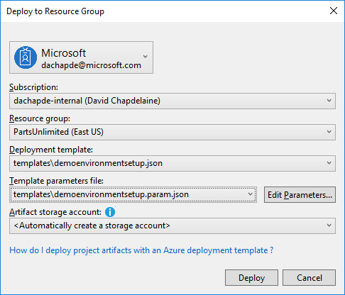
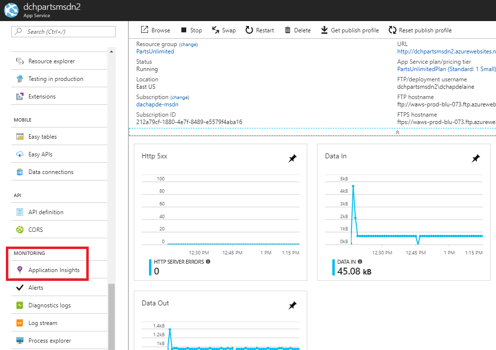

# HOL - Get started with web app development in Azure

In this lab we have an application called PartsUnlimited. We want to setup in Azure
an environment where we can deploy this application. In addition to that, we want
to monitor, update, scale, debug, etc...

## Pre-requisites

- Access to a MSDN Azure Subscription
- A Microsoft Account which can be created [here](https://signup.live.com) if you don't already have one

## Setup your environment

To complete this lab you will need to either configure your environment or deploy an already configured VM in Azure.

### Option 1: Deploy from Azure

Here is the step by step guide to deploy this virtual machine.

- Open the [Azure Portal](https://portal.azure.com)
- Press the New button on the top left to deploy a new Azure Resource

  
- Search for "Visual Studio Community 2017" and then press enter to filter.

  
- Select Visual Studio Community 2017 (latest release) on Windows 10 Enterprise N (x64)
- Follow the creation wizard. Since the machine will be up for only a few hours, I suggest provisioning a beefy one to get the best performances.

### Option 2: Configure your own environment

Here are the tools that should be installed:

- Visual Studio Community 2017 which can be downloaded [here](https://www.visualstudio.com/thank-you-downloading-visual-studio/?sku=Community&rel=15)
- Run the installer and make sure to select ".NET Desktop Development", "ASP.NET and web development tools" and "Azure development". This will ensure that you have all the required components including SQL Serer Express installed.

  

## Tasks Overview

### Clone the repository

 In this step, you will clone the source code repository from Github using Visual Studio. You will also checkout the aspnet45 branch where the relevant code is located.

- Open Visual Studio 2017 and open the Team Explorer.
- Select the manage connection button

  
- Enter https://github.com/dchapdelaine/PartsUnlimited.git as the URL of the repo. Press clone to initiate the cloning.
- Once the cloning has completed, change the current branch to aspnet45. To do so, select the "master" branch at the lower right of the screen and then select the manage branches menu.

  
- Expand the "remotes/origin" node and then double-click on "aspnet45"

> Note: This could also be done with git on the commandline. You would run:
> ```bat
> git clone https://github.com/dchapdelaine/PartsUnlimited.git
> cd PartsUnlimited
> git checkout aspnet45
> ```

### Build and run locally

Now that we have cloned the source code, we can open the solution, build it and then run it!

- Open the solution file. You can do so by simply going back to the Solution Explorer view and clicking the highlighted button in the screenshot.

  
- You can then start your web application by pressing F5. The application will take a minute to start as it builds and initialize the database.


### Manually deploy the environment in Azure

Now that we know that our application runs well locally, we can move to deploying it to Azure. Before we think about deploying it, we must create the environment in Azure that will host our application.

- Go to the Azure Portal [here](https://portal.azure.com) and sign in with your Azure credentials. 
- Create a resource group that will contain all the Azure services related to our deployment. Whenver we need to deploy resources from now on, we will pick this resource group as the target.
  - Select the resource group tab on the left as shown below.

    
  - Add a new resource group by pressing the Add button as shown below and the following the wizard.

    
- Deploy an Azure Web App as the host of our deployment. We will use a slightly difference way than what was shwon for resource group creation.
  - Press the new button on the top left as shown below.

    
  - Select Web + Mobile and then Web App as shown below.

    
  - Fill in the form for the creation of the Web App. Make sure to reuse the resouce group that you have created previously and also to select "On" for Application Insights creation since we will leverage it later on to monitor our application.

    

    Create a new App Service Plan that will define the compute resources that will power your Web App. Press the Create New button to open the App Service Plan creation wizard. For our needs, you can select any pricing tier except Isolated. Don't hesitate to pick beefier tiers since the Web App will be deleted after we are done with it. Make sure that the location matches the one from the resource group as we want to colocate our resources to minimize the latency. Press OK to return to the Web App creation wizard.

    
  - Press Create to launch the creation of the resource. This will take a short moment to complete. You can continue to the next step while it completes.
- It is now time to create the Azure SQL Database that will serve has the datastore for our Web App.
  - Press the new button on the top left as shown below.

    
  - Select Databases and then SQL Database as shown below.

    
  - Follow the creation wizard and fill in the parameters as shown below. A Basic tier database will suffice for our needs, but feel free to pick a larger one for more performance. Select the same resource group as we have been working with. As part of the creation, you will have to create a new Database Server. The name will have to be unique. Double check that the server is deployed in the same location as the Web App to ensure minimal latency and to avoid being charged for outbound data transfer!

    
    > Note: Later on, you can leverage the credentials that you have just added to connect with SQL Management Studio. To do that you will first have to whitelist your public IP in the SQL Server settings in the Azure Portal.
  - Press the Create button to launch the database creation. It will take a short moment to complete.
  - After the database creation has completed, open this SQL Database resource in the Azure Portal and then copy the connection string from the SQL Server Resource as shown below and replace the username and password field with the proper values used to created the database server previously.

    
  - We will configure the Web App with this connection string. To do so, open the Web App resource in the Azure Portal.
  - Click on the Application Settings Tab as shown below.

    
  - Add a new connection string named "DefaultConnectionString" as shown below. Make sure that the username and password values are correct. Press the Save button above when you are done.

    

### Programatically deploying the environment in Azure

Now that you have seen how to deploy resources to Azure with the Azure Portal, we will levage Azure Resource Manager templates to programatically deploy the same resources. You will notice how it makes it easier to deploy identical environment for development, testing, production, etc...

- In the Solution Explorer, expand the "env" solution folder and right click the PartsUnlimitedEnv project. Select Deploy->New... as shown below

  
- Follow the deployment wizard and fill in the parameters as shown below. In the Resource Group field, make sure that you create a new one and don't deploy on top of our previous deployment.

  
- Press the Deploy button to move forward and open the configuration parameters of the deployment.
- Configure the deployment by editing the parameters. WebsiteName and PartsUnlimitedServerName must be globally unique since they will be used as part of a URL. Enter a password in the field PartsUnlimitedServerAdminLoginPassword that meets the requirements [here](https://docs.microsoft.com/en-us/sql/relational-databases/security/strong-passwords)

  
- Press the Save button to launch the deployment. It will take a few minutes to complete.

### Deploy our application to Azure

We now have two environemnts. One that was created manually and the other one which was created using ARM templates.

- Return to Visual Studio right click on the project PartsUnlimitedWebsite and then select Publish menu.
- Pick "Select Existing" then press the Publish Button to continue.
- Select either of the Web Apps that we have previously created and complete the publication wizard.
- Your Web App should now open and after a minute should display correctly. You might have to refresh once if you get an error to give time for the Web App to start and populate the database.
- Once the publication is done, repeat these previous steps to publish to the other Web App.

### Basic monitoring with Application Insights

Now that we have our web application running in Azure, we can start playing with it and monitoring its behavior.

- In the Azure Portal, open the Application Insights tab of the Web Application that you want to monitor as shown below.

  
- In the case of the deployment with ARM templates, the Application Insights resource is not mapped with our Web App. To do so, simply select the proper resource in the window shown below.

  
- Now that Application Insight is properly mapped, you should see requests timing and an option to open Application Insight. Feel free to open it and play around to discover what application insight can offer!

### Conclusion

Today you have learned the basic of deploying a Web Application to Azure with Azure Web Apps. Hopefully you found it easy and want to explore further.

#### More reading:
- [Here](https://www.visualstudio.com/en-us/docs/overview) you can find more documentation on the Visual Studio tooling to plan, build, deploy and monitor your application.
- [Here](https://docs.microsoft.com/en-us/azure/) you can find the relevant Azure documentation with quick starts, tools, SDK and the detailed documentation to get started.
- [Microsoft Virtual Academy](https://mva.microsoft.com/)
- [Microsoft Learning](https://www.microsoft.com/en-us/learning/azure-skills-training.aspx)
- [Training and certification for Azure](https://azure.microsoft.com/en-us/training/)